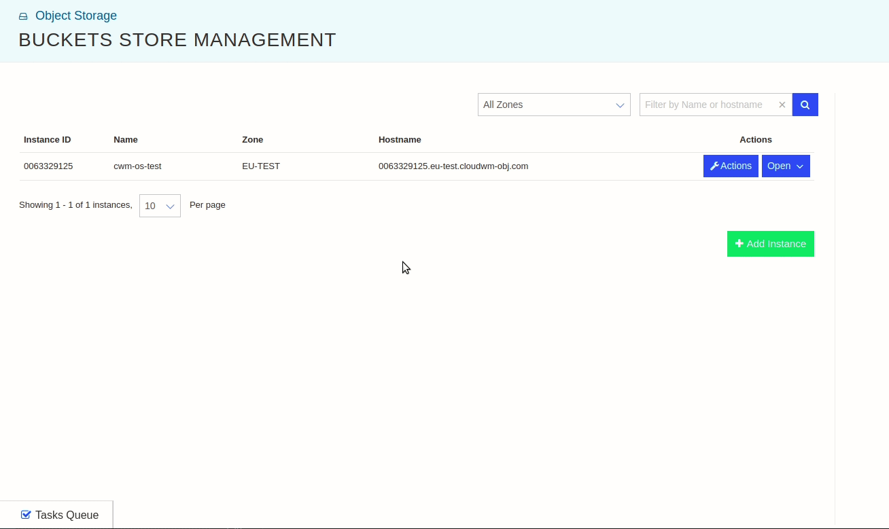

# Object Storage Console

- [Overview](#overview)
- [Object Storage Console: Features](#object-storage-console-features)
  - [Object Storage Console: Dashboard](#object-storage-console-dashboard)
  - [Object Storage Console: Object Storage](#object-storage-console-object-storage)
    - [Object Storage: Buckets Stores](#object-storage-buckets-stores)
    - [Object Storage: Gateway & Cache](#object-storage-gateway--cache)
    - [Object Storage: Pricing](#object-storage-pricing)
    - [Object Storage: Documentation](#object-storage-documentation)
  - [Object Storage Console: Billing](#object-storage-console-billing)
    - [Billing: Usage Reports](#billing-usage-reports)
  - [Object Storage Console: User Profile](#object-storage-console-user-profile)
- [Object Storage Console: How-Tos](#object-storage-console-how-tos)
  - [Object Storage Console: How to log in](#object-storage-console-how-to-log-in)
  - [Object Storage Console: How to navigate through Dashboard](#object-storage-console-how-to-navigate-through-dashboard)
  - [Object Storage Console: How to create a MinIO Instance](#object-storage-console-how-to-create-a-minio-instance)
  - [Object Storage Console: How to delete a MinIO Instance](#object-storage-console-how-to-delete-a-minio-instance)
  - [Object Storage Console: How to configure a MinIO Instance](#object-storage-console-how-to-configure-a-minio-instance)
- [MinIO Console: Features](#minio-console-features)
- [MinIO Console: How-Tos](#minio-console-how-tos)
  - [MinIO Console: How to log in via CWM MinIO Instance Credentials](#minio-console-how-to-log-in-via-cwm-minio-instance-credentials)

## Overview

The CWM Object Storage Console provides a a simple and easy-to-use WebUI to make
use of CWM Object Storage offerings. With the help of this Console, a user can
easily manage the MinIO instances according to the workload requirements.

The following sections discuss all the available features of the Console (CWM
Object Storage and MinIO instance) and how to use them effectively to make the
most of Console/WebUI.

**NOTE**: The terms Console and WebUI are used interchangeably throughout this
documentation. However, please observe the distinction between CWM Object
Storage Console/WebUI and MinIO's Console/WebUI.

---

## Object Storage Console: Features

The left panel of the Console provides the major supported features:

The following features are provided:

- Dashboard
- Object Storage
  - Buckets Stores
  - Gateway & Cache
  - Pricing
  - Documentation
- Billing
  - Usage Reports
- User Profile

### Object Storage Console: Dashboard

The **Dashboard** is the first screen that you see after logging in to the
Console. It provides a holistic view of all the MinIO instances, their health,
usage statistics, etc. Also, the stats provided by the Dashboard can be used to
create analytics reports for decision-making purposes.

### Object Storage Console: Object Storage

The **Object Storage** section from the left panel is the section that
specifically provides the options related to object storage:

- Object Storage
  - Buckets Stores
  - Gateway & Cache
  - Pricing
  - Documentation

#### Object Storage: Buckets Stores

The Buckets Stores provides options to create, delete, configure, search, etc.
the MioIO instances. The instance related options are available by clicking on
the specific instance.

#### Object Storage: Gateway & Cache

The **Gateway & Cache** provides the option to choose between cloud storage
alternatives for a CWM MinIO instance e.g. CloudWM, AWS S3, Azure Blob Store,
Google Object Store. This makes it easy to migrate from on-prem MinIO infra to
CWM without any vendor-locking of the object storage itself. This may also be
helpful to create redundancy by configuring the multiple object storage
solutions with the CWM MinIO instance.

#### Object Storage: Pricing

The **Pricing** section provides the price structure for CWM Object Storage
offerings for the MinIO's Buckets Stores, and Gateway & Cache.

#### Object Storage: Documentation

The **Documentation** section provides the help on configuring and the usage of
the CWM Object Storage.

### Object Storage Console: Billing

The **Billing** section provides an overview of the billed amount for the MinIO
instances.

#### Billing: Usage Reports

Under the **Usage Reports** section, you can see the billing summaries, filter
them according to dates, and export in CSV format.

### Object Storage Console: User Profile

The Console provides the features to reset your password, enable/disable
multi-factor authentication, configure your preferences, etc. You can navigate
to your profile by clicking on the User Profile icon

in the top-right corner.

## Object Storage Console: How-Tos

The following how-tos provide the general insights into the usage of CWM Object
Storage Console:

### Object Storage Console: How to log in

- Log in to [Object Storage Console](https://objectstorage.cloudwm.com/login).

  

- Enter your credentials or log in with the other available options e.g. Google,
  Facebook, or GitHub.

### Object Storage Console: How to navigate through Dashboard

TODO: Add details

### Object Storage Console: How to create a MinIO Instance

- Make sure that you're logged in.
- From the left panel, select **Object Storage** > **Buckets Stores**.
- From the right side, click on **Add Instance** button. A dialog box will
  appear.
- Select **Zone** from the drop-down list.
- Type in the **Instance Name**.
- Click on the **Add Instance** button.
- The new MinIO instance will appear on the right side.

Demo:

### Object Storage Console: How to delete a MinIO Instance

- Click on the **Actions** button
   on the instance
  you want to delete.
- From the drop-down menu, select the **Terminate** menu option. A confirmation
  dialog box will appear.
- Check on the **Check to allow Termination** checkbox.
- Click on the **Terminate Instance** button.

Demo:

### Object Storage Console: How to configure a MinIO Instance

- Click on the **Open** button
   of the MinIO instance
  that you want to configure.
- A new panel will appear on the right side showing all the properties and
  configurations of the selected MinIO instance. The right expanded panel will
  include the following tabs/sub-menus:

  - INFO
  - CONFIGURE
  - CACHE
  - REPORTS
  - LOGS

- The expanded right panel of an instance can be closed by clicking on the
  **Close** button .

Demo:

---

The following sections explore the features and usage of the CWM MinIO instance
available via CWM Object Storage offerings:

## MinIO Console: Features

The MinIO Console (Object Browser) provides a minimal WebUI to:

- create/remove buckets,
- upload/download objects; and,
- share the objects.

This WebUI is pretty intuitive. A typical user can easily explore all its
options in a matter of minutes and start building solutions on top of it.

## MinIO Console: How-Tos

The following how-tos provide the general insights into the usage of CWM MinIO
instance Console (Object Browser):

### MinIO Console: How to log in via CWM MinIO Instance Credentials

- You need the MinIO instance URL, Access Key, and Secret Key to log in. You can
  get these from the **INFO** tab of a MinIO instance.
- Open the URL in a browser.
- Log in by providing the Access and Secret keys.

Demo:

---

**NOTE**: This documentation aims to provide an up-to-date overview of the CWM
Object Storage Console and its supported MinIO instances. In case of any
discrepancies, please do contact support or
[open an issue](https://github.com/CloudWebManage/cwm-users-documentation/issues/new/choose)
on its [GitHub repository](https://github.com/CloudWebManage/cwm-users-documentation)
providing all the details.
