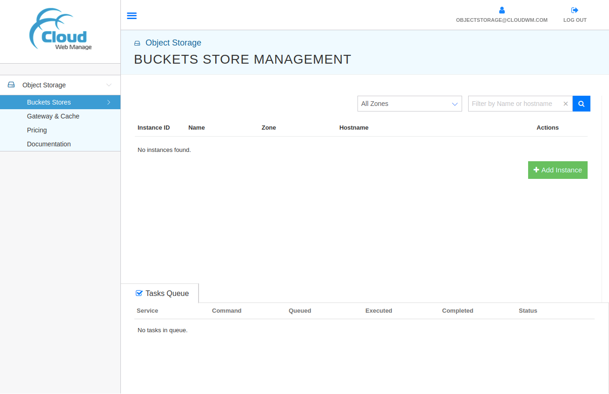
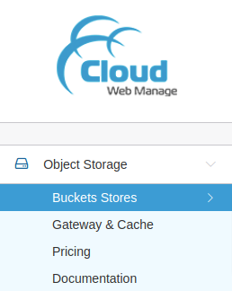
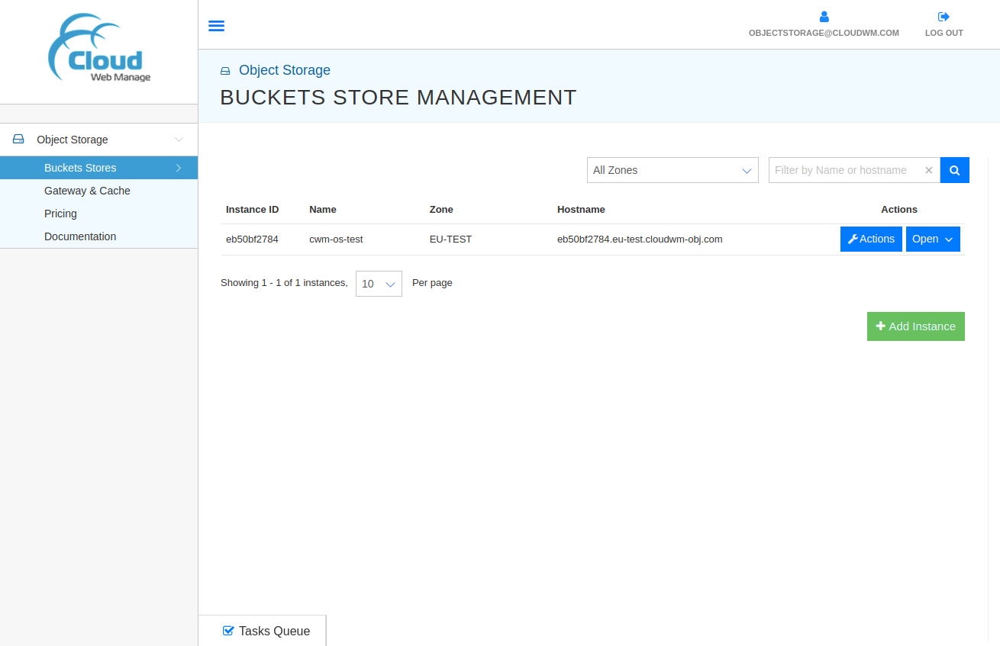

# Object Storage Management Console

<!--
  To update the TOC:
  * install nodejs (https://nodejs.org/en/)
  * run the following command:
    * npx doctoc@2.0.1 --github --notitle objectstorage/console.md
-->
<!-- START doctoc generated TOC please keep comment here to allow auto update -->
<!-- DON'T EDIT THIS SECTION, INSTEAD RE-RUN doctoc TO UPDATE -->

- [Overview](#overview)
- [Management Console: Features](#management-console-features)
  - [Management Console: Object Storage](#management-console-object-storage)
    - [Object Storage: Buckets Stores](#object-storage-buckets-stores)
    - [Object Storage: Gateway & Cache](#object-storage-gateway--cache)
    - [Object Storage: Pricing](#object-storage-pricing)
    - [Object Storage: Documentation](#object-storage-documentation)

<!-- END doctoc generated TOC please keep comment here to allow auto update -->

## Overview

The CWM Object Storage [Management Console](https://objectstorage.cloudwm.com/)
provides a simple and easy-to-use WebUI to make use of CWM Object Storage
offerings. Using the Management Console, users can easily manage the CWM Object
Storage instances according to their workload requirements.

Management Console:

---

## Management Console: Features

The left panel of the Management Console provides the supported features:

- Object Storage
  - Buckets Stores
  - Gateway & Cache
  - Pricing
  - Documentation

Left Panel:

### Management Console: Object Storage

The **Object Storage** section from the left panel expands the supported
features:

#### Object Storage: Buckets Stores

The **Buckets Stores** feature allows the users to create, delete, configure,
search, and perform other instance-related operations. The instance-related
options are available by clicking on the specific instance.

Example:

#### Object Storage: Gateway & Cache

The **Gateway & Cache** feature provides the option to choose the alternative
cloud storage providers such as CloudWM, AWS S3, Azure Blob Store, Google Object
Store. This option makes it easy to migrate from on-prem infra to CWM without
any vendor-locking of the object storage itself. This may also be helpful to
create redundancy by configuring multiple object storage solutions with the CWM
instances.

#### Object Storage: Pricing

The **Pricing** feature provides the price structure for CWM Object Storage for
its **Buckets Stores** and **Gateway & Cache** offerings.

#### Object Storage: Documentation

The **Documentation** section provides the help on how to configure and use the
CWM Object Storage.

---

**NOTE**: This documentation aims to provide an up-to-date overview of the CWM
Object Storage Management Console and its supported instances. In case of any
discrepancies, please do contact support or
[open an issue](https://github.com/CloudWebManage/cwm-users-documentation/issues/new/choose)
on its [GitHub repository](https://github.com/CloudWebManage/cwm-users-documentation)
providing all the details.
