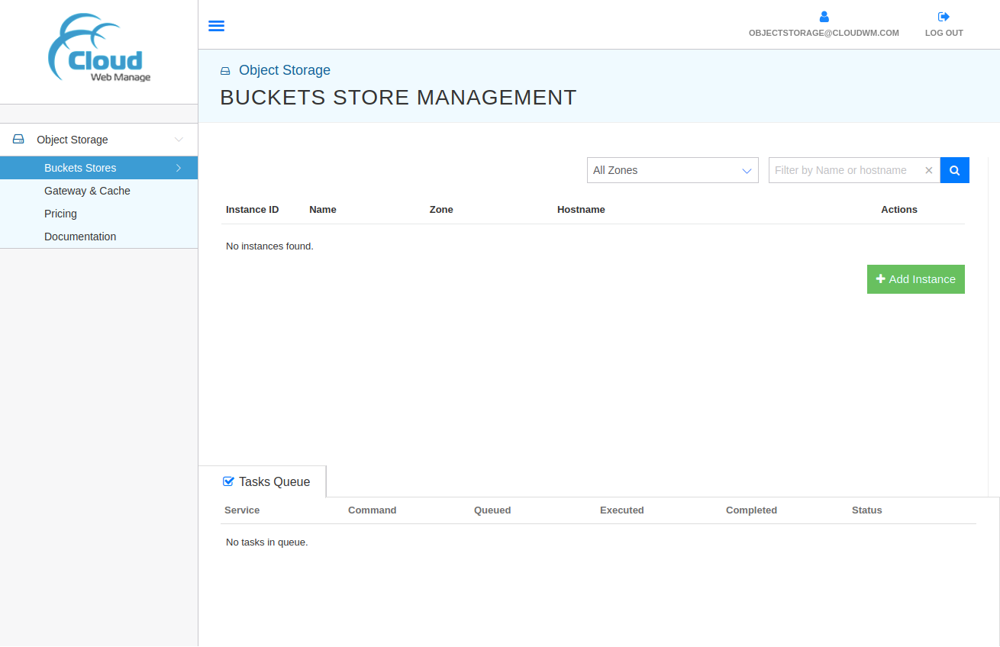
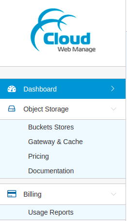
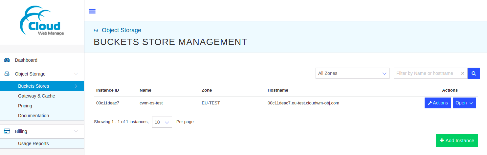
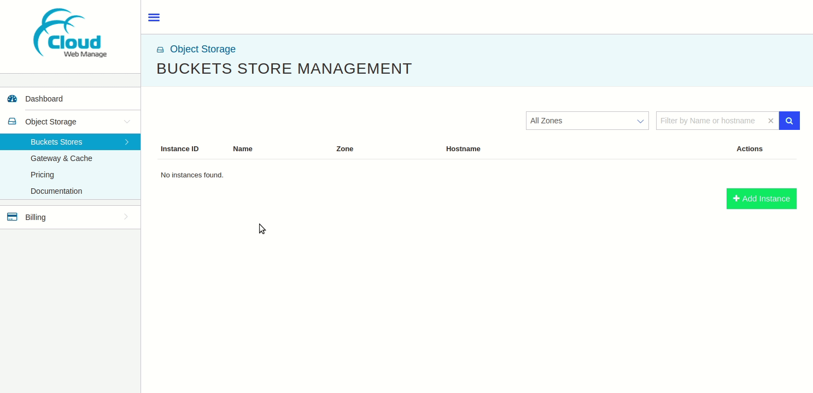
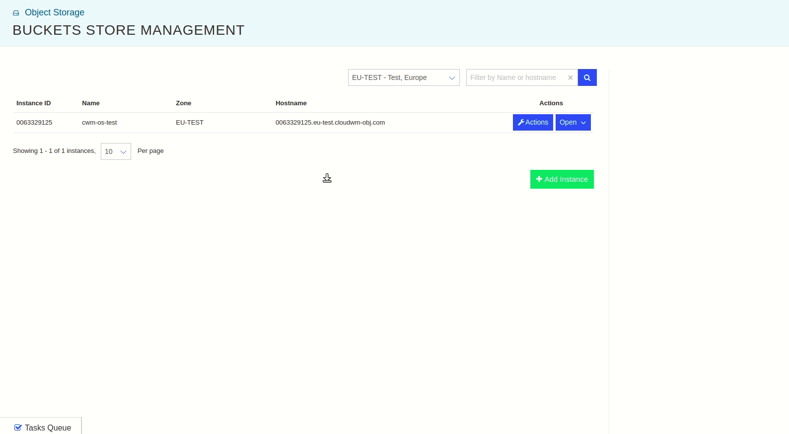
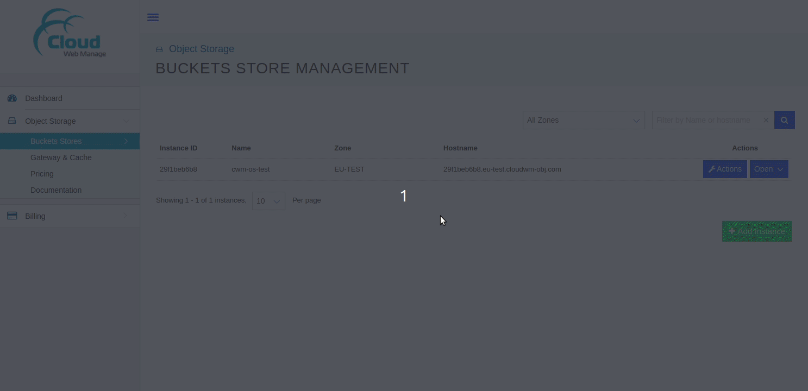

# Object Storage Management Console

- [Overview](#overview)
- [Management Console: Features](#management-console-features)
  - [Management Console: Object Storage](#management-console-object-storage)
    - [Object Storage: Buckets Stores](#object-storage-buckets-stores)
    - [Object Storage: Gateway & Cache](#object-storage-gateway--cache)
    - [Object Storage: Pricing](#object-storage-pricing)
    - [Object Storage: Documentation](#object-storage-documentation)
  - [Management Console: User Profile](#management-console-user-profile)
  - [Management Console: Tasks Queue](#management-console-tasks-queue)
- [Management Console: How-Tos](#management-console-how-tos)
  - [Management Console: How to create an instance](#management-console-how-to-create-an-instance)
  - [Management Console: How to configure an instance](#management-console-how-to-configure-an-instance)
  - [Management Console: How to delete an instance](#management-console-how-to-delete-an-instance)

## Overview

The CWM Object Storage [Management Console](https://objectstorage.cloudwm.com/)
provides a simple and easy-to-use WebUI to make use of CWM Object Storage
offerings. Using the Management Console, users can easily manage the CWM Object
Storage instances according to their workload requirements.

Management Console:

---

## Management Console: Features

The left panel of the Management Console provides the supported features:

- Object Storage
  - Buckets Stores
  - Gateway & Cache
  - Pricing
  - Documentation

Left Panel:

The Management Console also provides the **User Profile** and **Tasks Queue**
features.

### Management Console: Object Storage

The **Object Storage** section from the left panel expands the supported
features:

#### Object Storage: Buckets Stores

The **Buckets Stores** feature allows the users to create, delete, configure,
search, and perform other instance-related operations. The instance-related
options are available by clicking on the specific instance.

Example:

#### Object Storage: Gateway & Cache

The **Gateway & Cache** feature provides the option to choose the alternative
cloud storage providers such as CloudWM, AWS S3, Azure Blob Store, Google Object
Store. This option makes it easy to migrate from on-prem infra to CWM without
any vendor-locking of the object storage itself. This may also be helpful to
create redundancy by configuring multiple object storage solutions with the CWM
instances.

#### Object Storage: Pricing

The **Pricing** feature provides the price structure for CWM Object Storage for
its **Buckets Stores** and **Gateway & Cache** offerings.

#### Object Storage: Documentation

The **Documentation** section provides the help on how to configure and use the
CWM Object Storage.

### Management Console: User Profile

The **User Profile** feature provides the features to reset your password,
enable/disable multi-factor authentication, configure your preferences, etc. You
can navigate to your profile by clicking on the User Profile icon  in the top-right
corner.

### Management Console: Tasks Queue

The **Tasks Queue** feature of the Management Console helps you keep track of
the multiple parallel tasks.

## Management Console: How-Tos

The following how-tos provide the general insights into the usage of CWM Object
Storage Management Console:

### Management Console: How to create an instance

- Make sure that you're logged in.
- From the left panel, select **Object Storage** > **Buckets Stores**.
- From the right side, click on **Add Instance** button. A dialog box will
  appear.
- Select **Zone** from the drop-down list.
- Type in the **Instance Name**.
- Click on the **Add Instance** button.
- The new instance will appear on the right side.

Demo:

### Management Console: How to configure an instance

- Click on the **Open** button
   of the instance that
  you want to configure.
- A new panel will appear on the right side showing all the properties and
  configurations of the selected instance. The right expanded panel will include
  the following tabs/sub-menus:

  - INFO
  - CONFIGURE
  - CACHE
  - REPORTS
  - LOGS

- The expanded right panel of an instance can be closed by clicking on the
  **Close** button .

Demo:

### Management Console: How to delete an instance

- Click on the **Actions** button
   on the instance
  you want to delete.
- From the drop-down menu, select the **Terminate** menu option. A confirmation
  dialog box will appear.
- Check on the **Check to allow Termination** checkbox.
- Click on the **Terminate Instance** button.

Demo:

---

**NOTE**: This documentation aims to provide an up-to-date overview of the CWM
Object Storage Management Console and its supported instances. In case of any
discrepancies, please do contact support or
[open an issue](https://github.com/CloudWebManage/cwm-users-documentation/issues/new/choose)
on its [GitHub repository](https://github.com/CloudWebManage/cwm-users-documentation)
providing all the details.
