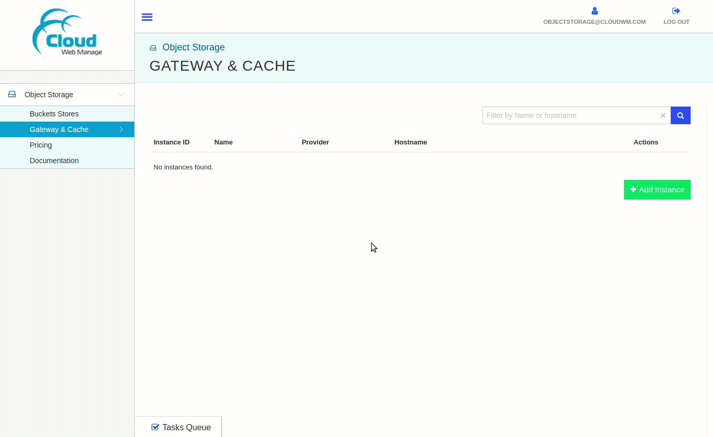
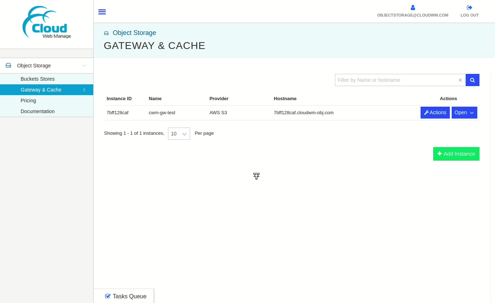

# Object Storage How To Guides

<!--
  To update the TOC:
  * install nodejs (https://nodejs.org/en/)
  * run the following command:
    * npx doctoc@2.0.1 --github --notitle objectstorage/howto.md
-->
<!-- START doctoc generated TOC please keep comment here to allow auto update -->
<!-- DON'T EDIT THIS SECTION, INSTEAD RE-RUN doctoc TO UPDATE -->

- [Create an instance](#create-an-instance)
- [Configure an instance](#configure-an-instance)
- [Delete an instance](#delete-an-instance)
- [Create an AWS S3 Gateway Instance](#create-an-aws-s3-gateway-instance)
  - [Test Connectivity of AWS S3 Gateway Instance](#test-connectivity-of-aws-s3-gateway-instance)

<!-- END doctoc generated TOC please keep comment here to allow auto update -->

## Create an instance

- Make sure that you're logged in to the management console.
- From the left panel, select **Object Storage** > **Buckets Stores**.
- From the right side, click on **Add Instance** button. A dialog box will
  appear.
- Select **Zone** from the drop-down list.
- Type in the **Instance Name**.
- Click on the **Add Instance** button.
- The new instance will appear on the right side.

Demo:

## Configure an instance

- Click on the **Open** button
   of the instance that
  you want to configure.
- A new panel will appear on the right side showing all the properties and
  configurations of the selected instance. The right expanded panel will include
  the following tabs/sub-menus:

  - INFO
  - CONFIGURE
  - CACHE
  - REPORTS
  - LOGS

- The expanded right panel of an instance can be closed by clicking on the
  **Close** button .

Demo:

## Delete an instance

- Click on the **Actions** button
   on the instance
  you want to delete.
- From the drop-down menu, select the **Terminate** menu option. A confirmation
  dialog box will appear.
- Check on the **Check to allow Termination** checkbox.
- Click on the **Terminate Instance** button.

Demo:

## Create an AWS S3 Gateway Instance

- From the left panel, click on **Gateway & Cache**.
- Click on **Add Instance** button from the right. Its dialog box will appear.
- Select **AWS S3** from the **Provider** drop-down list.
- Type in the **Instance Name**.
- Get your AWS S3 Access and Secret keys and fill in their respective fields.
  Click on **Add Instance** button of the dialog box and an instance will be
  added.

Demo:

### Test Connectivity of AWS S3 Gateway Instance

- Click on the **Open** button  of the
  instance that you want to test.
- From the properties panel, select **CONFIGURE**.
- Click on **Test Connectivity** button.
- The message **"Connected successfully."** will appear in case of a successful
  connection.

